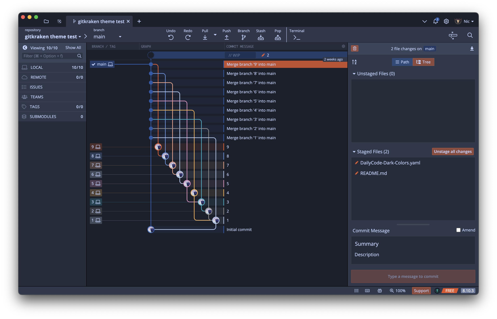

# DailyCode Dark GitKraken Theme

## OVERVIEW

Based on DailyPay with dark color themes.

[Making Your Own Theme](https://help.gitkraken.com/gitkraken-client/themes/)

To make your own custom theme, follow these steps:

1. Make a copy of one of the default theme files you’d like to base your custom theme off of in this folder.
2. Rename your copied file to be `MyCustomTheme.jsonc` (i.e. drop the `-default` from the extension and give it a unique name).
3. Open your new theme file in a text editor.
4. Change the `meta.name` property of your theme file to be something unique (a good idea would be to match the file name). The `name` will be used as the display for the option under `Preferences > UI Customization > Theme` in `GitKraken`, so make it something you’ll recognize. The scheme must be "light" or "dark", and will be used for default colors if anything is missing. If new properties are added in future releases, your theme will continue to work as-is, by using the scheme to choose a default color for the missing properties.
5. Back in `GitKraken`, find your new custom theme under `Preferences > UI Customization > Theme` and select it.
6. Edit the color values for any of the props under `themeValues`.